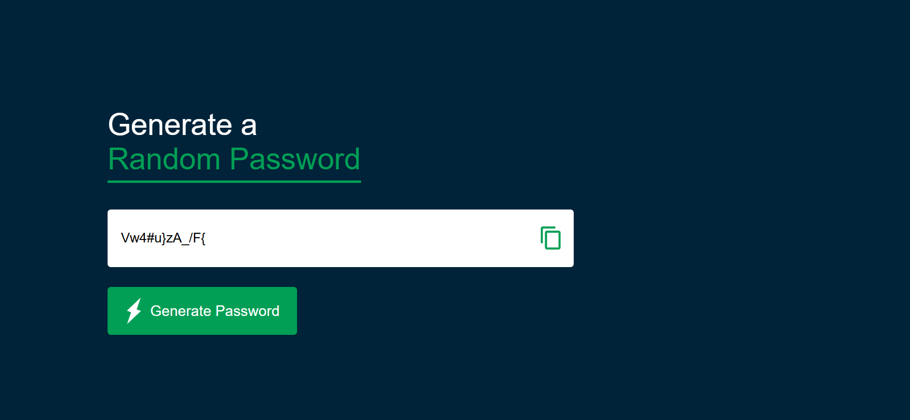

# Password Generator

A simple and responsive **Password Generator** built with **HTML, CSS, and JavaScript**.  
It generates strong random passwords and lets you copy them with one click.


## 🚀 Features
- Generate random passwords instantly  
- Password length: 12 characters by default  
- Includes uppercase, lowercase, numbers, and symbols  
- One-click copy to clipboard  
- Responsive and modern UI  

## 📸 Demo


## 🛠️ Technologies Used
- HTML5  
- CSS3  
- JavaScript (ES6)  

## ⚙️ How to Run
1. Clone this repository:
   ```bash
   git clone https://github.com/tejas-more09/Password-Generator.git


---

### 7. **Folder Structure (Optional)**
Show project layout.  
```markdown
## 📂 Project Structure
Password-Generator/
│── index.html
│── style.css
│── img/
│    ├── copy.png
│    └── generate.png

## 🤝 Contributing
Contributions are welcome!  
- Fork the repo  
- Make changes  
- Submit a Pull Request


